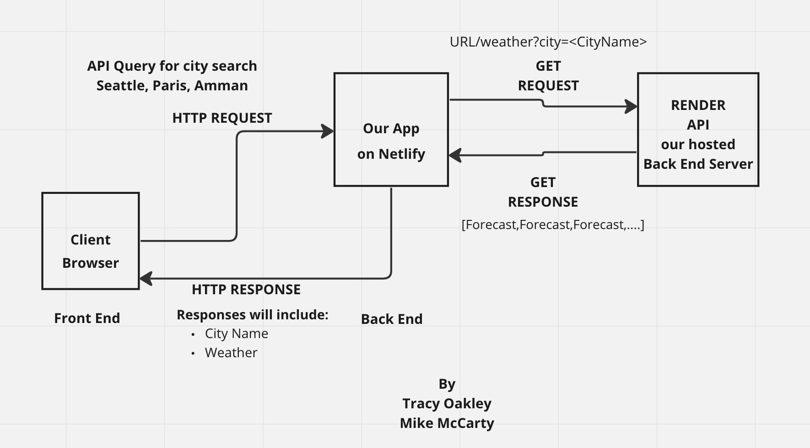
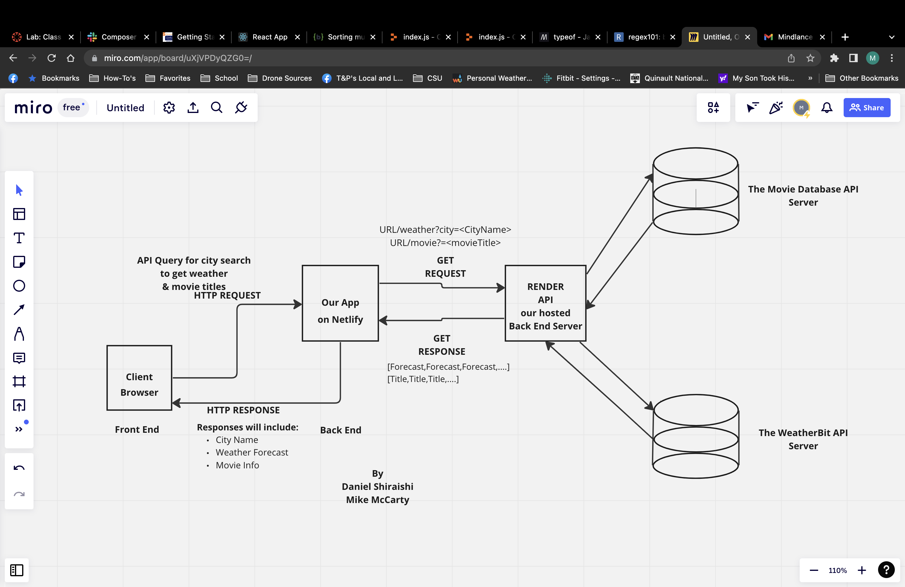
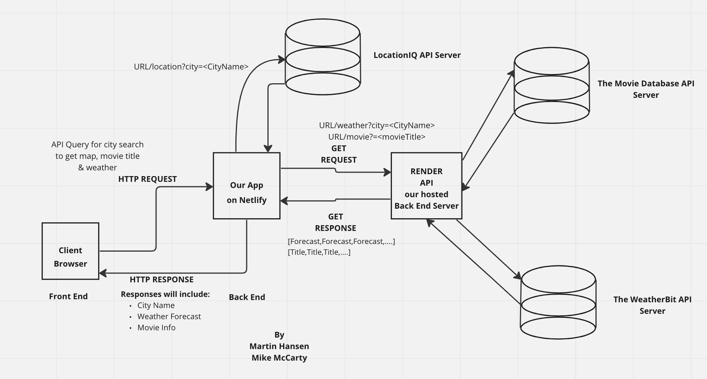

# city-explorer-api

(ver. 1.0)

## Author - Mike McCarty

This project is the third JS React app Using the first Back-End Server

## Lab 07/08

## Problem Domain

15/16 November - This server was originally built to be the API for receiving requests from the city-explorer front-end server to gain the weather data for three cities. Currently sending weather data but not yet being displayed on the front-end as it still needs to be built.
17 November - Weather data is now functioning in a modal for each city on the front end with appropriate error handling.
19 November - Shifted weather data to be retrieved from Weather Bit versus using the weather.json file.
20 November - Able to retrieve data from The Movie DB API and format it to send to the front end.

## Instructions

- Complete your Feature Tasks for the day.
- Create a Pull Request (PR) back to the main branch of your repository.
- Submit your assignment as a link to your PR, and a comment describing how much time you spent on the lab.

## Architectures

### Lab 7 Architecture

### Lab 8 Architecture

### Lab 9 Architecture

## Resources

- [deployment](https://facebook.github.io/create-react-app/docs/deployment)

- [Getting Started](https://reactjs.org/docs/getting-started.html)

- [React Bootstrap](https://react-bootstrap.github.io/)

## Change Log

- 2:15pm Initial repository for back-end built on local developer's machine and on Github (ToDo1)
- 5:55pm Completed lab 7 functionality
- 1:30pm 20 November successfully added and displaying The Movie DB data retrieval

## Comments & Reflections Lab 7

### Number and name of feature: Feature #1 - Set up server repository

Estimate of time needed to complete: 120 minutes
Start time: 1:00pm
Finish time: 2:12pm
Actual time needed to complete:  1 hour 12 minutes

### Number and name of feature: Feature #2 - Weather

Estimate of time needed to complete: ~ 10 hours
Start time: 2:30pm (Tuesday)
Finish time: 4:55pm (Thursday)
Actual time needed to complete: Worked for 3 hours on Tuesday, worked for ~3 hours on Wednesday, and almost 4 hours on Thursday

### Number and name of feature: Feature 3 - Errors

Estimate of time needed to complete: 2 hours
Start time: 5:00pm
Finish time: 5:55pm
Actual time needed to complete: 55 minutes

## Comments & Reflections Lab 8

### Number and name of feature: Feature #1 - Weather (live)

Estimate of time needed to complete: 10 hours
Start time: 10:30am
Finish time: 3:30pm
Actual time needed to complete: 5 hours

### Number and name of feature: Feature #2 - Movies

Estimate of time needed to complete: 10 hours
Start time: 3:45pm (Saturday)
Finish time: 1:40pm (Sunday)
Actual time needed to complete:  ~ 9 hours

### Number and name of feature: Feature #3 - Publish

Estimate of time needed to complete: 2 hours
Start time: 1:30pm
Finish time: pm
Actual time needed to complete:
